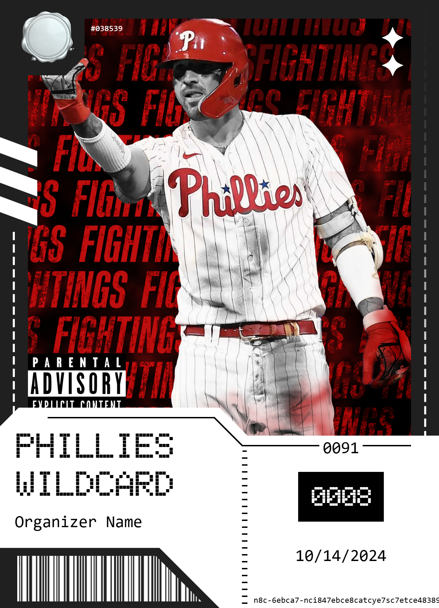
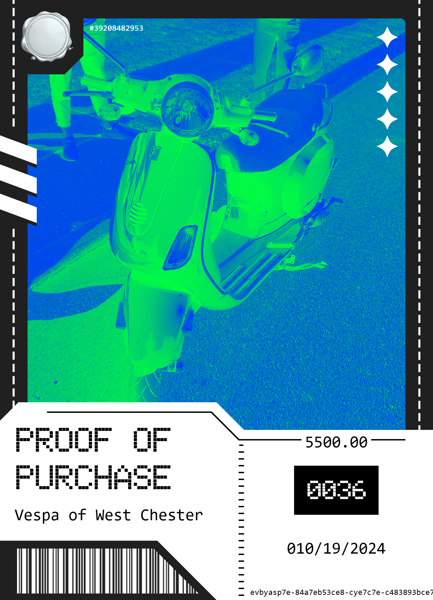

 

 

<h3 align="center">Soulvenir | Less shilling, more chilling 😎</h3>

An open-source platform for creating soulbound NFT cards to prove attendance, authenticity, or access. Built on ERC-721 SBTs, each collectible is non-transferable, verifiable, and fully customizable. No flipping — just permanent, on-chain proof of participation.
   
 <a href="https://soulvenir.vercel.app/"><strong>Try it Online »</strong></a>

___

### Features
- Mint soulbound NFTs for events or items.
- View collection in fun 3D style.
- MetaMask wallet integration.

---

  
  ‎ ‎ ‎ ‎ ‎ ‎ ‎ 
  
  ‎ ‎ ‎ ‎ ‎ ‎ ‎ 
  

---

### Planned features:
- [ ] Other wallet integration.
- [ ] Add default template images and placeholders in case providing a URL is not possible.

_Feel free to submit pull requests!_

---

### Known bugs:
- [ ] Yes I know I spelled raccoon wrong...

_Please report any bugs you find!_

---

### Libraries used:
- jQuery

### Fonts used:
- EHSMB
- CoseGrottesche

### Special thanks:
- Simon Goellner
